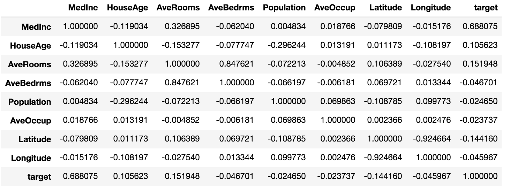

### Import libraries I need
```
import pandas as pd
import numpy as np
import matplotlib.pyplot as plt
from sklearn.linear_model import LinearRegression
from sklearn.model_selection import KFold
from sklearn.model_selection import train_test_split as tts
from sklearn.preprocessing import StandardScaler as SS
from sklearn.datasets import fetch_california_housing
from sklearn.linear_model import Ridge
from sklearn.linear_model import Lasso
from sklearn.metrics import mean_squared_error
```

### Create your DoKFold
```
def DoKFold(model, your_feature_obj, your_target_obj, k, standardize = False, random_state = 146):
    kf = KFold(n_splits=k, shuffle=True, random_state=random_state)

    if standardize:
        ss = SS()

    # add an object for your training scores
    train_score = []
    # add an object for your testing scores
    test_score = []
    # add an object for your training MSE
    train_mse = []
    # add an object for your testing MSE
    test_mse = []

    # add your for loop where you create idxTrain & idxTest using kf.split with your features
    for idxTrain, idxTest in kf.split(X):
        Xtrain = X[idxTrain, :]
        Xtest = X[idxTest, :]
        ytrain = y[idxTrain]
        ytest = y[idxTest]

        if standardize:
            Xtrain = ss.fit_transform(Xtrain)
            Xtest = ss.fit_transform(Xtest)
            
        # fit your model on this line using your training data
        model.fit(Xtrain, ytrain)
        
        train_score.append(model.score(Xtrain, ytrain))        
        # use your feature and target testing data to calculate your model score and append it to the test score object
        test_score.append(model.score(Xtest, ytest))
        
        y_train_predict = model.predict(Xtrain)
        y_test_predict = model.predict(Xtest)

        #train_mse.append(mean_squared_error(ytrain, y_train_predict))
        #test_mse.append(mean_squared_error(ytest, y_test_predict))
        
        train_mse.append(np.mean((ytrain - y_train_predict) ** 2))
        test_mse.append(np.mean((ytest - y_test_predict) ** 2))
        
    return train_score,test_score,train_mse,test_mse
```
### import the data, set X as features and y as target
```
data = fetch_california_housing()

housing = pd.DataFrame(data.data)
housing.columns = data.feature_names
housing['target'] = data.target

X = np.array(housing.iloc[:, :8])
y = np.array(housing['target'])
```

### Question 15
To calculate the correlations between every feature and target, we could just calculate correlations between all variables
```
housing.corr()
```
which gives us the following output:


From that, we know that MedInc is the variable that is most strongly correlated with the target.

### Question 16
For this question we could just create a copy of the original dataframe, standardize all the features columns and calculate the correlations again. This gave me exact same results as the above question.

```
ss = SS()
housing_trans = housing
ss.fit_transform(housing_trans.iloc[:, :8])
housing_trans.corr()
```
### Question 17
For this question, we could calculate the correlation coefficient matrix for MedInc and the target. The value at second position of row 1/ first position at row 2 represents the correlation between MedInc and target. We could take either of these two values and square it to get the coefficient of determination. We could use `np.round` to round the number to desired number of digits after decimal point.
```
np.round(np.corrcoef(housing['MedInc'],y)[0][1]**2, 2)
```

### Question 18
Call linear regression method and use the DoKFold function to fit the model. Set k=20 and standardize = True
```
lin_reg = LinearRegression()
train_score, test_score, mse_train, mse_test = DoKFold(lin_reg, X, y, 20, standardize = True)
print(np.mean(train_score))
print(np.mean(test_score))
print(np.mean(mse_train))
print(np.mean(mse_test))
```

### Question 19

In order to find the optimal alpha value when mean testing score is maximized, create a list to record the average testing score for each option of alpha in the range, and use `argmax` to find the index for the highest average testing score and its corresponding training/testing score/mse.
```
a_range = np.linspace(20, 30, 101)

k = 20

avg_tr_score=[]
avg_te_score=[]
avg_tr_mse = []
avg_te_mse = []

for a in a_range:
    rid_reg = Ridge(alpha=a)
    train_scores,test_scores, train_mse, test_mse = DoKFold(rid_reg,X,y,k)
    avg_tr_score.append(np.mean(train_scores))
    avg_te_score.append(np.mean(test_scores))
    avg_tr_mse.append(np.mean(train_mse))
    avg_te_mse.append(np.mean(test_mse))

idx = np.argmax(avg_te_score)
print(avg_tr_score[idx], avg_te_score[idx], avg_tr_mse[idx], avg_te_mse[idx])
print('Optimal alpha value: ' + format(a_range[idx], '.3f'))
```

### Question 20
Exactly the same with question 19 except for different alpha range and lasso regression model this time.
```
a_range = np.linspace(0.001, 0.003, 101)

k = 20

avg_tr_score=[]
avg_te_score=[]
avg_tr_mse = []
avg_te_mse = []

for a in a_range:
    las_reg = Lasso(alpha=a)
    train_scores,test_scores, train_mse, test_mse = DoKFold(las_reg,X,y,k)
    avg_tr_score.append(np.mean(train_scores))
    avg_te_score.append(np.mean(test_scores))
    avg_tr_mse.append(np.mean(train_mse))
    avg_te_mse.append(np.mean(test_mse))

idx = np.argmax(avg_te_score)
print(avg_tr_score[idx], avg_te_score[idx], avg_tr_mse[idx], avg_te_mse[idx])
print('Optimal alpha value: ' + format(a_range[idx], '.3f'))
```

### Question 21
Fristly, standardize all the features using `ss.fit_transform`
```
ss = SS()
X_trans = ss.fit_transform(X)
```
Then do the fitting for linear, ridge and lasso regression respectively
```
lin_reg = LinearRegression()
lin = lin_reg.fit(X_trans, y)

rid_reg = Ridge(alpha=20.8)
rid = rid_reg.fit(X_trans, y)

las_reg = Lasso(alpha=0.00186)
las = las_reg.fit(X_trans, y)
```
From the correlation table in question 15, we know that AvgOccup is the least correlated variable with the target. Its index is 5 in the features, so we take a look at the coefficient for each model at position 5.
```
print(lin.coef_[5], rid.coef_[5], las.coef_[5])
```

### Question 22
Now we take a look at the coefficient for MedInc, which has an index 0.
```
print(lin.coef_[0], rid.coef_[0], las.coef_[0])
```

### Question 23
The code is pretty much the same with question 19. The only difference is that now we choose the index that corresponds to the smallest average mse of testing set.
```
a_range = np.linspace(20, 30, 101)

k = 20

avg_tr_score=[]
avg_te_score=[]
avg_tr_mse = []
avg_te_mse = []

for a in a_range:
    rid_reg = Ridge(alpha=a)
    train_scores,test_scores, train_mse, test_mse = DoKFold(rid_reg,X,y,k)
    avg_tr_score.append(np.mean(train_scores))
    avg_te_score.append(np.mean(test_scores))
    avg_tr_mse.append(np.mean(train_mse))
    avg_te_mse.append(np.mean(test_mse))

idx = np.argmin(avg_te_mse)
print(avg_tr_score[idx], avg_te_score[idx], avg_tr_mse[idx], avg_te_mse[idx])
print('Optimal alpha value: ' + format(a_range[idx], '.3f'))
```

### Question 24
Same with quesiton 23 except for different alpha range and lasso regression this time.
```
a_range = np.linspace(0.001, 0.003, 101)

k = 20

avg_tr_score=[]
avg_te_score=[]
avg_tr_mse = []
avg_te_mse = []

for a in a_range:
    las_reg = Lasso(alpha=a)
    train_scores,test_scores, train_mse, test_mse = DoKFold(las_reg,X,y,k)
    avg_tr_score.append(np.mean(train_scores))
    avg_te_score.append(np.mean(test_scores))
    avg_tr_mse.append(np.mean(train_mse))
    avg_te_mse.append(np.mean(test_mse))

idx = np.argmin(avg_te_mse)
print(avg_tr_score[idx], avg_te_score[idx], avg_tr_mse[idx], avg_te_mse[idx])
print('Optimal alpha value: ' + format(a_range[idx], '.3f'))
```

For the test I did not get the last question correct. I still did not quite figure out the reason since I had pretty much the exact same code but I kept giving me 0.001 as the result.
