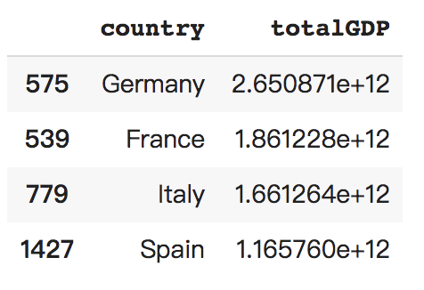

### Question 1
Packages are namespaces which contain multiple packages and modules themselves. They are simply directories that must contain special files called ```__init__.py``` 
in order to indicate that the directory it contains is a python package. Libraries are collections of packages.

In order to use packages, you need to first install them(with the two packages we used in class as an example):
```
pip install pandas
pip install numpy
```
Then we need to import them to the local workspace:
```
import pandas
import numpy
```
For the sake of convenience, we could also apply alias to libraries:
```
import pandas as pd
import numpy as np
```
Say we want to use a specific module in numpy. We can simply type np.xxx as opposed to numpy.xxx, which has greater chance to introduce bugs.

### Quetion 2
A data frame is a 2-dimensional data structure with columns of potentially different data types. Pandas library is particularly useful to work with data frames.
In order to import the data from a remote location. You need to use ```read_csv``` function in pandas library and specify the location of file and its separator.
```
path_to_file = #some specific path to the target file
df = pd.read_csv(path_to_file, sep = '\t') #use tab as the separator
```
It is important to specify the type of data we are dealing with after the ```read_```. Here as an example we are dealing with tsv file so we use ```read_csv``` and set tab as the separator. We are also able to use ```read_excel```,```read_sql```, etc.

One way to describe the data frame is to use ```df.shape```. You can use ```df.shape[0]``` to get the number of rows, and ```df.shape[1]``` to get the number of columns. Alternatively, you can use ```len(df.index)``` to get the number of rows, and ```len(df.columns)``` to get the number of columns.

### Question 3
Through interogatting year column with ```df['year']```, I found that the every 12 rows form a subset, and each subset has a range from 1952-2007 with an interval of 5 years. There are in total 1704/12 = 142 subsets. If we want to add more rows to make it more up to date, we can add year 2012 and 2017 to each subset. Since there are 6 columns, we need to add 12 more new outcomes for each subset.

### Question 4
We could use ```df.loc[df['lifeExp'].idxmin()]``` to find that Rwanda in year 1992 has the shortest life expectancy of only 23.599. This is probably because of the large-scale civil war in Rwanda from 1990-1994.

### Question 5
Firstly, create a new column called ```totalGDP``` as the product of ```pop``` and ```gdpPercap``` and store it in the original df,
```
df['totalGDP'] = df['pop'] * df['gdpPercap']
```
Then slice out the 4 countries data in 2007. We can do this by first slicing out all rows in year 2007 and then slice out those whose ```country``` matches what we want.
```
x = df.loc[(df['year'] == 2007) & ((df['country'] == 'Germany') | (df['country'] == 'France') | (df['country'] == 'Italy') | (df['country'] == 'Spain'))]
```
Then we just keep ```country``` and ```totalGDP``` column and sort them in descending order.
```
x.loc[:,['country', 'totalGDP']].sort_values('totalGDP', ascending = False)
```
This is the result we get, which indicates that Germany exhibited the most significant increase in total gross domestic product during the previous 5-year period (to 2007).



### Question 6
```==``` checks if left-hand side is exactly the same with the right-hand side. It returns TRUE if these two match, and FALSE otherwise.

```&``` stands for AND. It returns TRUE only when all of the arguments are TRUE.

```|``` stands for OR. It returns TRUE when any one of the arguments is TRUE.

In programming, the above three operators are powerful in terms of selecting desired data from data frame. For example, if we want to select all data for Asia in year 2007, we can use the following command to slice out those data that are both for Asia AND for year 2007.
```
df.loc[(df['continent'] == 'Asia') & (df['year'] == 2007)]
```
If we want to select data that are either for Asia OR for Europe, we can use ```|```,
```
df.loc[(df['continent'] == 'Asia') & (df['continent'] == 'Africa')]
```
### Question 7 (?)
```loc``` locates rows and columns through labels of index. ```iloc``` locates rows and columns through positions, which are in the form of integers, of the index.

### Question 8
api acts as a bridge between two applications. It is able to deliver our requests to the provider, where our targets locate, and then it is able to deliver the response back to us.
In order to construct a request to remote server, we need the requests library and then give the url for our desired data,
```
import requests
url = #some real url
```
Then we need to create a folder that stores a file that will record our downloaded data later.
```
# Use the os library for this
import os

#build a folder called 'data'
data_folder = 'data'
if not os.path.exists(data_folder):
    os.makedirs(data_folder)

# Now construct the file name
file_name_short = 'ctp_' + str(dt.now(tz = pytz.utc)).replace(' ', '_') + '.csv'
file_name = os.path.join(data_folder, file_name_short)

```
We can now retrives the content from url and open our output file for writing (w) in binary mode (b). After that, we can do the regular import of data through pandas. Then we can manipulations we want to the data frame in the workspace.
```
r = requests.get(url)
with open(file_name, 'wb') as f:
    f.write(r.content)
    
import pandas as pd
df = pd.read_csv(file_name)
```
### Question 9

Pandas.apply allow the users to pass a function and apply it on every single value of the Pandas series. For example, if we want the sum for every column in a data frame, instead of wirting a loop that iterate each column, now we can use ```df.apply(np.sum, axis = 0)```
The apply function has easier syntax and thus less chance to introduce bugs. In addition, although apply function also loops through an axis, it is still more efficient due to some internal optimization.

### Question 10
Use ```loc```. For example, if we simply want ```country``` and ```year``` column for the above data frame. We can do that through specifying the column labels we want, keep all rows through ```:``` and assign it to a new data frame.
```
df_new = df[:, ['country', 'year']]
```
