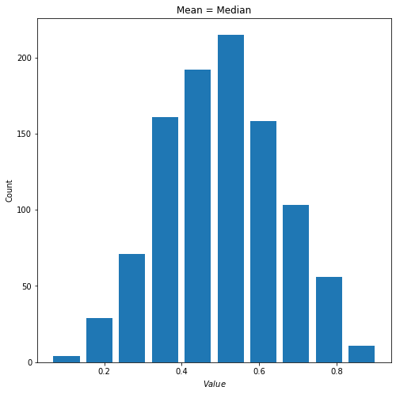
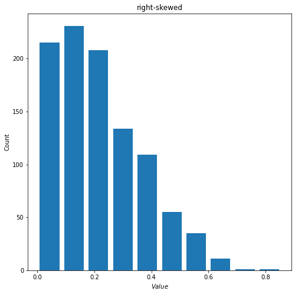
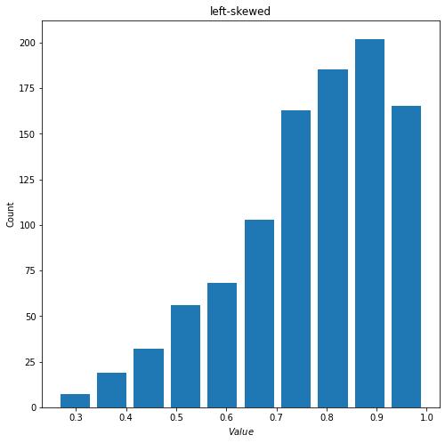
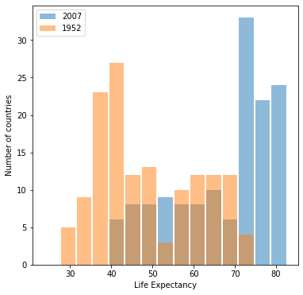
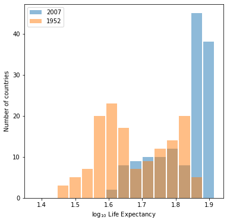
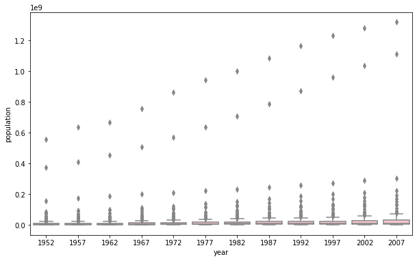
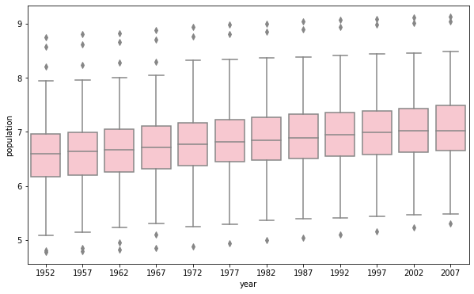

### Question 1
continuous: quantitative data that is able to take any value within a range. Examples are weight, height, temperature, and age.

ordinal: categorical data with an intrinsic order. Only the order but not the difference between them is important. A typical example is ranking.

nominal: categorical data without an intrinsic order. Examples are countries and cities.

An exemplary model could be a linear regression model that aims to predict a salesman's salary(target) based on one's educational level(ordinal: below high school, 
high school, BS, MS, PhD), ethnicity(nominal: minority/non-minority), and average sales per month(continuous), which are features.

### Question 2
1) When alpha=beta, the beta distribution is symmetric with its mean at located at the center. When I set alpha=beta=5 and generate 1000 random observations I got the following distribution.
* mean = 0.5003436291300151
* median = 3.5005643139370388

2) When alpha<beta, the mean for beta distribution will be greater than its median, which indicates a right-skewed distribution. Below is an example with alpha = 1.5 and beta = 5.
* mean = 0.22042345183582107
* median = 0.1903307503513733

3) When alpha<beta, the mean for beta distribution will be smaller than its median, which indicates a left-skewed distribution. Below is an example with alpha = 5 and beta = 1.5.
* mean = 0.770204270403717
* median = 0.798167645798253

### Question 3
* Histogram for raw data

* Histogram for log transformed data

Both of them are able to show to following characteristics:
* From 1952 to 2007, the distribution as a whole shifts to the right. This indicates that the general life expetation has become longer globally.
* Both mean and median for life expectancy of the year 2007 are higher compared to those of 1952.
* The distribution for 2007 is lef-skewed with a significant proportion of countries with life expectancy over 70(1.8 for log-transformed one). 

With two plots both able to convey the same information, the raw data one is preferred since it is able to show the numerical information more directly through its x-axis.

### Question 4
* population(raw data)

* population(log-transformed)

It is better to pick the log-transformed one. The one plotted using raw data has y-axis with really large scale. The box parts, as a result, are too tiny for us to estmiate the mean and quantiles. It is also difficult to visualize the difference of boxplots for each year. The only trend that the raw data plot is able to show is that the maximum population for each year is increasing. Whereas the log-transformed one is also able to show that the mean and interquartile are also increasing overtime.
