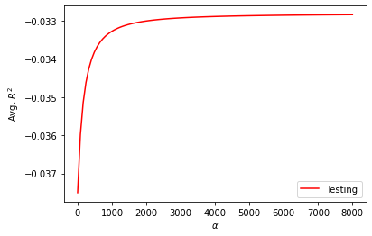

### Question 1
Given that there are 715 rows in total, I have tried 8, 10, 12, 15 folds and the corresponding average of train and test scores are as the following:

* k = 8
  * train score: 0.019477178686178
  * test score: -0.024545646835335944

* k = 10
 * train score: 0.019514638368914018
 * test score: -0.037502267848572614

* k = 12
 * train score: 0.019399126134301125
 * test score: -0.025932644957946994

* k = 15
 * train score: 0.019206809563629627
 * test score: -0.036841997269859754

For all the above choices of folds, the scores are all pretty far from 1. For test scores those are even below zero. Those indicate that linear model fitted in this way is not able to produce reliable result.

### Question 2
Same choices of number of folds is applied here, and the corresponding average of train and test scores are as the following:

* k = 8
 * train score: 0.01947717868617793
 * test score: -0.024545646835334625

* k = 10
 * train score: 0.019514638368914004
 * test score: -0.037502267848572315

* k = 12
 * train score: 0.019399126134301115
 * test score: -0.025932644957947327

* k = 15
 * train score: 0.019206809563629655
 * test score: -0.03684199726985993

All the training and testing scores are still extremely small or even negative. In fact, there is not much difference between the scenario with and without the standardizaiton of features. Standarzing features is not the way to improve the performance of model.

### Question 3
#### Features not standardized
For each choice of fold, the alpha is chosen between a large enough range in order to find the one corresponding to the global maximum of average testing score:

* k = 8
 * optimal alpha value: 523.232
 * train score: 0.019
 * test score: -0.023

* k = 10
 * optimal alpha value: For this one I have tried a range of [0,8000]. The highest average testing score keep increasing as the alpha value increases. However, as the graph shows the curve is already pretty flat and increasing alpha may not be able to help with testing score much. Hence although I did not find the global maximum, I took 8000 as the approximate of optimal alpha value.
 
 
 
 * train score: 0.018
 * test score: -0.033.

* k = 12
 * optimal alpha value: 3232.323
 * train score: 0.018
 * test score: -0.022

* k = 15
 * optimal alpha value: Similar with the k = 10 case, the global maximum of average testing score is not able to be found when alpha is chosen between [0,10000] but the increasement is already small enough to be ignored when alpha = 10000, so I took that as the approximate of optimal alpha value.
 * train score: 0.017
 * test score: -0.03

#### Features standardized

* k = 8
 * optimal alpha value: 909.091
 * train score: 0.017
 * test score: -0.016

* k = 10
 * optimal alpha value: 707.071
 * train score: 0.017
 * test score: -0.031

* k = 12
 * optimal alpha value: 909.091
 * train score: 0.017
 * test score: -0.016

* k = 15
 * optimal alpha value: 2222.22
 * train score: 0.002
 * test score: -0.053

__Conclusion__: Based on the training and testing scores above, the ridge regression still do not improve much about the performance of model no matter features are standardized or not. For each choice of number of folds, the testing score corresponding to the optimal alpha value is still above 0.

### Question 4

Given that there are 659 observations in total for this dataset, the previous choice of k-fold (8, 10, 12, 15) is still sensible choice for this dataset.

#### Linear regression with out standardization of features

* k = 8
  * train score: 0.004828895997905758
  * test score: -0.05882744471588147

* k = 10
 * train score: 0.004454887667329499
 * test score: -0.061630609940973836

* k = 12
 * train score: 0.0043661985278358835
 * test score: -0.061090030222472336

* k = 15
 * train score: 0.004109840416140501
 * test score: -0.06028445451485857

#### Linear regression with standardization of features

* k = 8
  * train score: 0.004828895997905799
  * test score: -0.05882744471587825

* k = 10
 * train score: 0.004454887667329444
 * test score: -0.0616306099409739

* k = 12
 * train score: 0.004366198527835828
 * test score: -0.06109003022247352

* k = 15
 * train score: 0.004109840416140501
 * test score: -0.060284454514857845

For the ridge regression, although previous analysis of `charleston_ask.csv` suggests little difference betweem the performance of model with or without standardization of features. I still try both for ridge regression, since the above observation may not be able to applied to this different dataset.

#### Ridge regression without standardization of features

* k = 8
 * approximate optimal alpha value (for the same reason as the above scernario): 10000
 * train score: 0.002
 * test score: -0.046

* k = 10
 * approximate optimal alpha value: 10000
 * train score: 0.002
 * test score: -0.052

* k = 12
 * approximate optimal alpha value: 10000 
 * train score: 0.002
 * test score: -0.05

* k = 15
 * approximate optimal alpha value: 10000
 * train score: 0.002
 * test score: -0.055

#### Ridge regression with standardization of features

* k = 8
 * optimal alpha value: 3939.394
 * train score: 0.001
 * test score: -0.043

* k = 10
 * optimal alpha value: 2525.253
 * train score: 0.002
 * test score: -0.005

* k = 12
 * optimal alpha value: 9090.909
 * train score: 0.001
 * test score: -0.047

* k = 15
 * optimal alpha value: 2222.22
 * train score: 0.002
 * test score: -0.053

