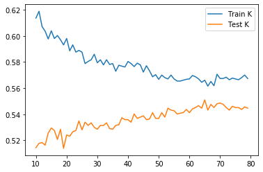
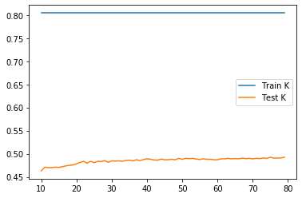
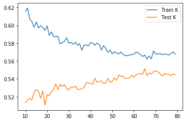
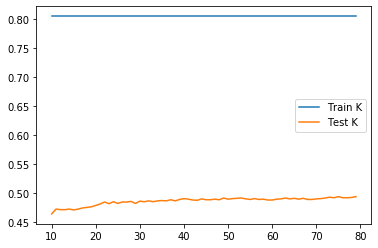

### Execute a K-nearest neighbors classification method on the data. What model specification returned the most accurate results? Did adding a distance weight help?

* w/o distance weight

The test score is maximized(0.5510004880429478) when k = 65.

* w/ distance weight

The test score is maximized(0.4924353343094192) when k = 75, so adding distance weight does not help with increasing accuracy.

### Execute a logistic regression method on the data. How did this model fair in terms of accuracy compared to K-nearest neighbors?

I got 0.5478515625 for training score and 0.550024402147389 for testing score. If we compare testing score, logistic regression is better than KNN w/ weight and is slightly less accurate than KNN w/o weight.

### Next execute a random forest model and produce the results. See the number of estimators (trees) to 100, 500, 1000 and 5000 and determine which specification is most likely to return the best model. Also produce results for your four different estimator values by both comparing both standardized and non-standardized (raw) results.

#### non-standardized

* 100 trees
  * test score = 0.4802342606149341
  * accuracy (using compare class) = 0.4807223035627135

* 500 trees
  * test score = 0.48121034651049294
  * accuracy = 0.4763299170326989

* 1000 trees
  * test score = 0.48462664714494874
  * accuracy = 0.48560273304050755

* 5000 trees
  * test score = 0.4880429477794046
  * accuracy = 0.488530990727184 

Based on both test score and accuracy, 5000 trees is most likely to return the best model.

* Also test the minimum number of samples required to split an internal node with a range of values
  From a range of (20, 30) for minimum number of samples to split, the number of 22 returns the best results with testing score at 0.5461200585651538.

#### standardized

* 100 trees
  * test score = 0.4851146900927282
  * accuracy (using compare class) = 0.4802342606149341

* 500 trees
  * test score = 0.48657881893606636
  * accuracy = 0.48657881893606636

* 1000 trees
  * test score = 0.48755490483162517
  * accuracy = 0.48462664714494874
 
* 5000 trees
  * test score = 0.48462664714494874
  * accuracy = 0.48462664714494874

Based on accuracy, 500 trees is most likely to return the best model. Based on test score, 1000 trees is most likely to return the best model.

### Repeat the previous steps after recoding the wealth classes 2 and 3 into a single outcome. Do any of your models improve? Are you able to explain why your results have changed?

I replaced all wealth class 2 with 3, and then go through the same process.

#### KNN

* w/o distance

The testing score is maximized(0.5514885309907271) when k = 65.

* w/ distance

The testing score is maximized(0.49389946315275746) when k = 75.

Compared to models seperating wealth classes 2 and 3, the optimal alphas are exactly the same, the testing scores just slightly improve. 

#### logistic regression

Training score is 0.5478515625 and testing score is 0.550024402147389, which is exactly the same with the logistic regression model seprating wealth classes 2 and 3.

#### Random Forest

* w/o std
  * 100 trees
    * testing score: 0.4816983894582723
    * accuracy: 0.4787701317715959
  * 500 trees
    * testing score: 0.48462664714494874
    * accuracy: 0.48121034651049294
  * 1000 trees
    * testing score: 0.48316251830161056
    * accuracy: 0.4899951195705222
  * 5000 trees
    * testing score: 0.48413860419716936
    * accuracy: 0.48462664714494874

Based on accuracy, 1000 trees is the most optimal one, which is slightly higher than the maximized accuracy for the model separating class 2&3 (0.488530990727184 ).

Based on testing score, 500 trees is the most optimal one, which is slightly lower than the maximized testing score for the model separating class 2&3 (0.4880429477794046).

* w/ std
  * 100 trees
    * testing score: 0.4743777452415813
    * accuracy: 0.4807223035627135
  * 500 trees
    * testing score: 0.4826744753538311
    * accuracy: 0.48365056124938993
  * 1000 trees
    * testing score: 0.48413860419716936
    * accuracy: 0.48316251830161056
  * 5000 trees
    * testing score: 0.48657881893606636
    * accuracy: 0.48462664714494874

Based on both accuracy and testing score, 5000 trees is the most optimal one. They are both slightly lower than the the maximized accuracy(0.48657881893606636) and the maximized testing score(0.48755490483162517) correspondingly for the model separating wealth classes 2&3.

For all models, the testing score or accuracy either keeps the same (logistic regression) or changes to an extent too small to be considered significant. That's probably because wealth class 2 has a really small size(64) compared to the total sample size(5121). Merging them together would not bring too significant influence to performance of the models. 

Despite that, my guess for the slight improvement of KNN is that maybe KNN tends to make mistakes through "under-classsifying" samples (i.e. not able to tell that A&B come from two groups when they actually are). When we merge wealth classes 2&3 together, these failures about distincting class 2&3 are ignored so the performance is improved slightly. 

My guess for the reason for logistic regression keeping exactly the same score is that probably mistakes are all for the classification of wealth class 3&4&5, so merging class 2&3 does not change anything here.

I still have not quite understand why model performance slightly decreases for some random forest models. My guess is that maybe there are some samples with great difference belonging to wealth class 2&3 separtely mering together now, which may seems "confusing" to the RF algorithm and negatively influences its ability to make distinction between classes.

### Which of the models produced the best results in predicting wealth of all persons throughout the large West African capital city being described?

The best model I have so far is KNN w/o distance, k=65. However, it does not perform significantly better than the other ones and its testing score is still far from being considered as perfect. That's probably because there are only 4 features to be used for making predictions, and we probably need more than that.

